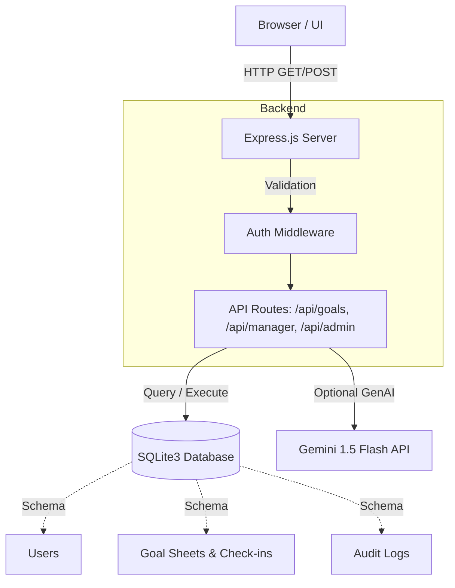

# AtomQuest Goals Portal 🚀

**AtomQuest** is a comprehensive, full-stack Performance Management SaaS application designed to streamline goal setting, quarterly check-ins, and HR compliance across organizations.

   

---

## 🌐 Live Demo
The application is live and available for review at:
**[https://atomquest-portal-6bkr.onrender.com](https://atomquest-portal-6bkr.onrender.com)**

---

## 🌟 Key Features

### 🔐 Strict Role-Based Access Control (RBAC)
Dedicated portals and API validation for three user tiers:
1. **Employees:** View assigned performance goals, log quarterly check-ins (Q1-Q4), and track overall achievement percentages.
2. **Managers:** Review team overview metrics, approve or reject incoming goal sheets, and monitor direct reports.
3. **HR Admins:** Gain a bird's-eye view of organizational compliance. Export system-wide reports to CSV and monitor granular changes via the System Audit Log.

### 🎨 Modern, Dynamic UI
- **Real-time Tab Switching:** Eliminates jarring page refreshes using seamless DOM injection for a true Single Page Application (SPA) feel.
- **Global Theme Support:** Fully integrated Dark Mode / Light Mode capability utilizing Tailwind CSS, with user preferences persisting via local storage.
- **Responsive Design:** Engineered to look beautiful and professional across desktops and tablets.

### 🛡️ Robust Backend Architecture
- Express.js middleware enforces strict role verification on all API routes to prevent privilege escalation.
- Comprehensive SQLite3 database schema supporting foreign-key constraints for users, managers, goal sheets, individual goals, check-ins, and audit logs.
- Automatic EADDRINUSE crash protection.

---

## 🛠️ Technology Stack

* **Frontend:** HTML5, Vanilla JavaScript, Tailwind CSS (via CDN), Google Material Symbols.
* **Backend:** Node.js, Express.js.
* **Database:** SQLite3.
* **Architecture:** Traditional RESTful API + Session-based authentication.

---

## 🚀 Getting Started

### Prerequisites
Make sure you have [Node.js](https://nodejs.org/) installed on your machine.

### Installation

1. **Clone the repository:**
   ```bash
   git clone https://github.com/Swanand08/atomberg-atomquest.git
   cd atomquest-portal
   ```

2. **Install dependencies:**
   ```bash
   npm install
   ```

3. **Configure Environment:**
   Copy the example environment file and add your Gemini API key (if applicable) and session secrets.
   ```bash
   cp .env.example .env
   ```

4. **Initialize the Database:**
   *(Optional)* If you want to start with a fresh slate of mock data, simply delete `atomquest.db` and the server will automatically seed realistic data upon startup.

5. **Start the Server:**
   ```bash
   npm run dev
   ```
   *or*
   ```bash
   node server.js
   ```

5. **Access the Portal:**
   Open your browser and navigate to `http://localhost:3000`.

### 🔑 Demo Credentials

To test the different portals, you can log in using the pre-seeded credentials:

| Role | Email | Password | Notes |
| :--- | :--- | :--- | :--- |
| **HR Admin** | `admin@company.com` | `admin123` | Full system access |
| **Manager** | `manager1@company.com` | `mgr123` | Team oversight & approvals |
| **Employee** | `emp1@company.com` | `emp123` | Pre-loaded with demo goals & check-ins |
| **Employee (Clean Slate)** | `emp2@company.com` | `emp123` | No goals — perfect for live demo! |

---

## 🏗️ Architecture



---

## 📁 Project Structure

```text
├── public/                 # Static frontend files (HTML, CSS, JS config)
│   ├── login.html          # Unified authentication gateway
│   ├── employee.html       # Employee dashboard & goal check-ins
│   ├── manager.html        # Team oversight & goal sheet approvals
│   └── admin.html          # Global compliance, audit logs, & exports
├── routes/                 # Express API backend endpoints
│   ├── auth.js             # Login, logout, role-validation & profile data
│   ├── goals.js            # Goal creation, editing, & check-in logic
│   ├── manager.js          # Manager approval workflows & team activity
│   └── admin.js            # System-wide metrics, audit log fetching & CSV generation
├── server.js               # Main Express application entry point & middleware
├── database.js             # SQLite3 connection & auto-seeding logic
└── .env                    # Environment configurations (Port, DB path)
```

---

## 👨‍💻 Development & Contribution
This application uses a centralized error-handling strategy and requires specific role authorizations for API access. When contributing:
- Always enforce `requireRole([roles])` on new API endpoints.
- Ensure any UI tab functionality utilizes the existing `tab-content` hidden/block toggling system to maintain SPA consistency.

---

**Built with dedication for performance and stability.** 
